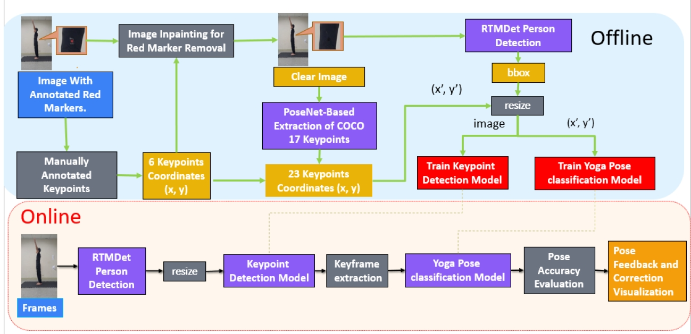
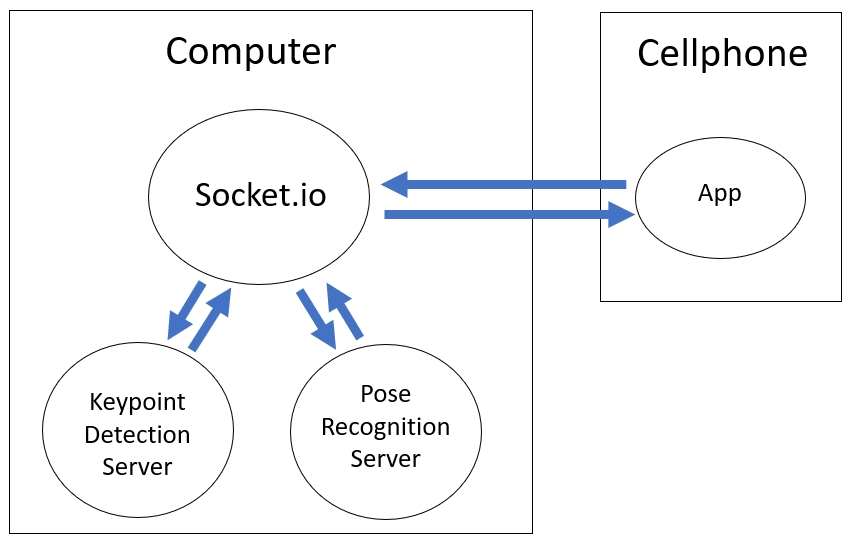

# Yoga Posture Correction System 🧘‍♂️

---

## 📄 論文與展示 (Research & Demo)

* **完整論文**: [點此閱讀論文全文](https://docs.google.com/document/d/16b6bfrFxcTbrZ5zuPxvS1gzXgA2JIc3-/edit?usp=drive_link&ouid=111932951906831359654&rtpof=true&sd=true)
* **Demo 影片**: [點此查看系統運行演示](https://youtube.com/shorts/sPIlRIg1YYc?feature=share)

---

## 🏗 系統架構 (System Architecture)
| 系統總體架構圖 | 圖例說明 |
| :---: | :---: |
|  |  |

1.  **android app & server (`android-socket-main`)**: 
    * 負責將手機端攝像頭影像壓縮並透過 Socket 協定傳輸。包含 App 端 Client 與後端接收 Server，透過 Socket 協定實現低延遲的雙向影像傳輸。

2.  **keypoint detection(`mmpose-custom`)**: 
    * 基於 MMPose 進行二次開發。
    * 在原有的COCO17個關鍵點上，自定義了6個關鍵點，共23個關鍵點，以及改用 EPE做為評估指標。

3.  **pose recognition (`pose_classification-master`)**: 
    * 使用 FCNN 進行姿勢辨識。

## 📈 實驗結果 (Experimental Results)

根據論文實驗數據，本系統展現出高度的穩定性與準確度：

| 評估項目 | 實驗結果 |
| :--- | :--- |
| **分類精度 (Accuracy)** | **99% 以上** (針對十種常見瑜伽動作) |
| **定位誤差 (Position Error)** | **低於 10 公分** (優於國際標準) |
| **即時性 (Latency)** | 支援近即時影像回饋，有效提升練習安全性 |

## 🏗️ 連線機制 (Connection Architecture)
| 連線總體架構示意圖 |
| :---: | 
|  |

## 🚀 安裝

請分別進入
* [android-socket](https://github.com/ChinoEst/Yoga-Posture-Correction-System/tree/master/android-socket)
* [mmpose-custom](https://github.com/ChinoEst/Yoga-Posture-Correction-System/tree/master/mmpose-custom)
* [pose_classification](https://github.com/ChinoEst/Yoga-Posture-Correction-System/tree/master/pose_classification)
